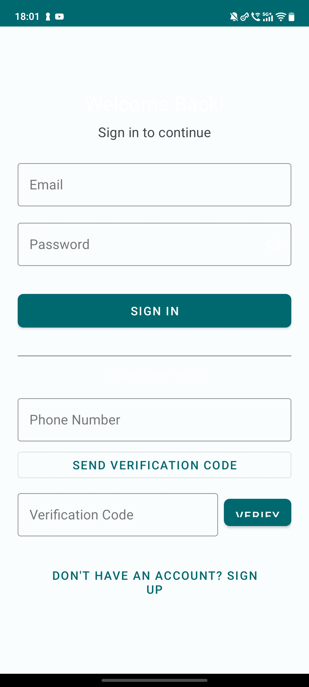
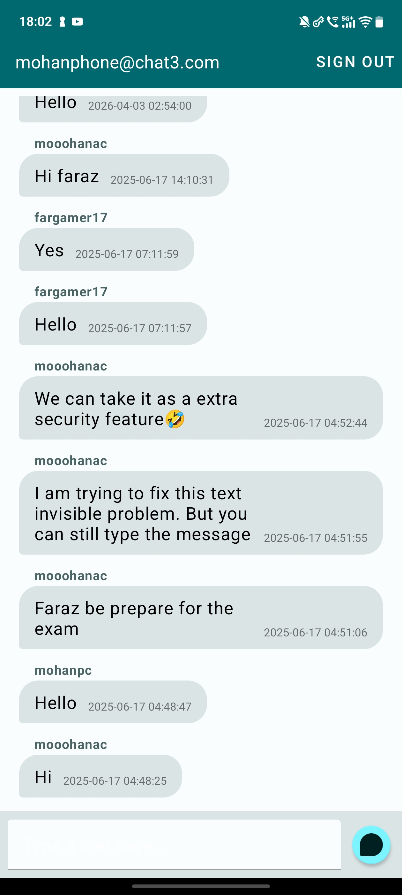
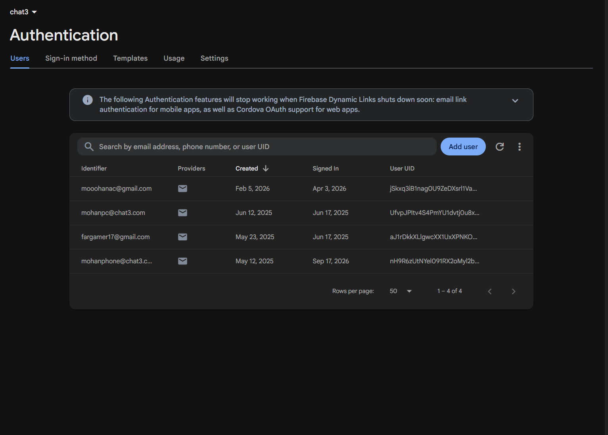
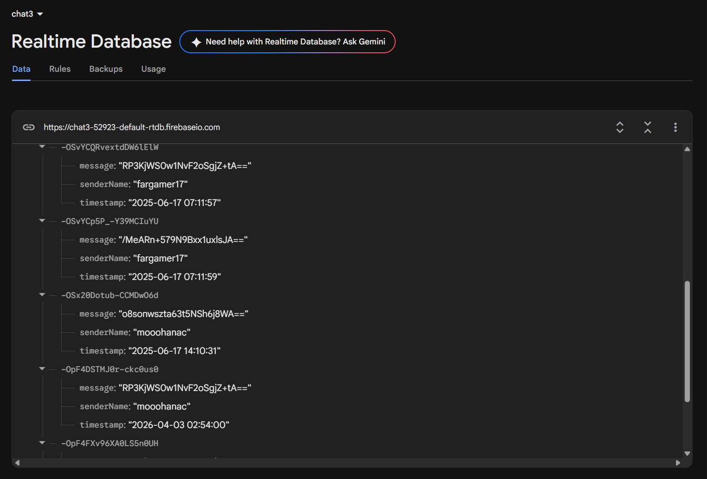

# secureSandesh

`secureSandesh` is an Android chat application that provides authenticated messaging through Firebase. Users can create accounts, sign in with email and password or phone verification, and exchange messages stored in Firebase Realtime Database.

## Screenshots

### Authentication

The application provides email/password authentication and phone-number verification through Firebase Authentication.

<p align="center">
  
</p>

<p align="center">
  <b>Sign-in screen</b> — Email/password and phone verification authentication
</p>

### Chat Interface

After authentication, users can exchange messages in real time. The chat interface displays sender names, message content, and timestamps.

<p align="center">
  
</p>

<p align="center">
  <b>Real-time chat interface</b> — Firebase Realtime Database synchronized messaging
</p>

### Firebase Authentication

User accounts are managed through Firebase Authentication.

<p align="center">
  
</p>

<p align="center">
  <b>Firebase Authentication dashboard</b> — Registered users and authentication providers
</p>

### Firebase Realtime Database

Messages exchanged through the application are synchronized and stored using Firebase Realtime Database.

<p align="center">
  
</p>

<p align="center">
  <b>Firebase Realtime Database</b> — Stored chat messages and sender information
</p>

## Technology stack

- Java
- Android SDK 34
- Gradle with Kotlin DSL
- Android Gradle Plugin 8.3.1
- Kotlin Gradle Plugin 1.8.0
- Firebase Authentication
- Firebase Realtime Database
- Firebase Analytics
- AndroidX AppCompat, Activity, Core KTX, and RecyclerView
- Material Components
- Google Play Services Auth

## Getting started

### Prerequisites

Install the following before building the project:

- Android Studio with Android SDK support
- JDK 8 or a compatible Android Studio JDK
- Android SDK Platform 34
- An Android emulator or physical device running Android 8.0/API 26 or newer
- A Firebase project configured for Android

### Configure Firebase

The repository contains `app/google-services.json` as a placeholder. Replace it with the configuration file generated for your Firebase Android application.

1. Create or select a project in the [Firebase Console](https://console.firebase.google.com/).
2. Add an Android application with the package name:

   ```text
   com.example.chat3
   ```

3. Download the generated `google-services.json`.
4. Replace the placeholder file at:

   ```text
   app/google-services.json
   ```

5. Enable the required Firebase services:
   - Email/Password authentication
   - Phone authentication
   - Realtime Database
   - Analytics, if analytics collection is desired

For phone authentication, configure the Firebase phone provider and add the required test phone numbers or device verification settings in the Firebase Console.

Do not commit credentials or environment-specific Firebase configuration to a public repository unless the project is configured appropriately for public distribution.

### Clone the repository

```bash
git clone https://github.com/professortate/secure_sandesh_app.git
cd secure_sandesh_app
```

### Build the application

On macOS or Linux:

```bash
./gradlew assembleDebug
```

On Windows:

```bat
gradlew.bat assembleDebug
```

The generated debug APK is written to:

```text
app/build/outputs/apk/debug/app-debug.apk
```

### Install on a connected device

With an Android device or emulator connected:

```bash
./gradlew installDebug
```

You can also install the generated APK manually using Android Studio or `adb`:

```bash
adb install app/build/outputs/apk/debug/app-debug.apk
```

## Using the app

1. Launch `secureSandesh`.
2. Create an account with an email address and password, or use the phone verification flow.
3. Sign in using the configured Firebase Authentication provider.
4. Enter a message in the chat input.
5. Select the send button to publish the message.
6. Select **Sign Out** to return to the sign-in screen.

Messages are stored under the `messages` node in Firebase Realtime Database.

## Project structure

```text
.
├── app/
│   ├── build.gradle.kts
│   ├── google-services.json       # Firebase configuration placeholder
│   └── src/
│       ├── main/
│       │   ├── AndroidManifest.xml
│       │   ├── java/com/example/chat3/
│       │   │   ├── MainActivity.java       # Chat screen and Firebase database access
│       │   │   ├── SignInActivity.java     # Email and phone sign-in
│       │   │   ├── SignUpActivity.java    # Account creation and phone linking
│       │   │   ├── MessageAdapter.java    # RecyclerView message adapter
│       │   │   └── MessageItem.java       # Firebase message model
│       │   └── res/
│       │       ├── layout/                 # Sign-in, sign-up, chat, and message layouts
│       │       ├── drawable/               # Chat message backgrounds and graphics
│       │       ├── values/                 # Colors, strings, IDs, and themes
│       │       └── xml/                    # Backup and data-extraction configuration
│       ├── androidTest/                    # Instrumentation tests
│       └── test/                           # Local unit tests
├── Apk/                                   # Checked-in APK build artifacts
├── androidTest/                           # Additional generated instrumentation artifacts
├── build.gradle.kts                       # Root Gradle configuration
├── settings.gradle.kts                    # Project and repository configuration
├── gradle.properties                      # AndroidX and Gradle settings
├── gradlew                                # Gradle wrapper for Unix-like systems
└── gradlew.bat                            # Gradle wrapper for Windows
```

## Testing

Run the local unit tests with:

```bash
./gradlew test
```

Run instrumentation tests on a connected emulator or device with:

```bash
./gradlew connectedAndroidTest
```

Instrumentation tests require an available Android device or emulator.

## Support

For project-specific questions or bug reports:

- Search existing [GitHub Issues](https://github.com/professortate/secure_sandesh_app/issues).
- Open a new issue with:
  - Android version and device or emulator details
  - Steps to reproduce the problem
  - Relevant Gradle or Firebase error output
  - A description of the expected and actual behavior

For platform documentation, refer to:

- [Android Developers](https://developer.android.com/)
- [Firebase Authentication](https://firebase.google.com/docs/auth)
- [Firebase Realtime Database](https://firebase.google.com/docs/database)
- [Gradle Build Tool](https://docs.gradle.org/)

## Contributing

Contributions are welcome.

1. Fork the repository.
2. Create a focused branch for your change.
3. Make the change and add or update tests where appropriate.
4. Run the relevant Gradle checks locally.
5. Open a pull request describing the change and its testing status.

Please avoid committing private Firebase configuration, generated build output, or unrelated IDE files.

## Maintainer

Maintained by [professortate](https://github.com/professortate).


## License

This project is licensed under the MIT License - see the [LICENSE](LICENSE) file for details.
